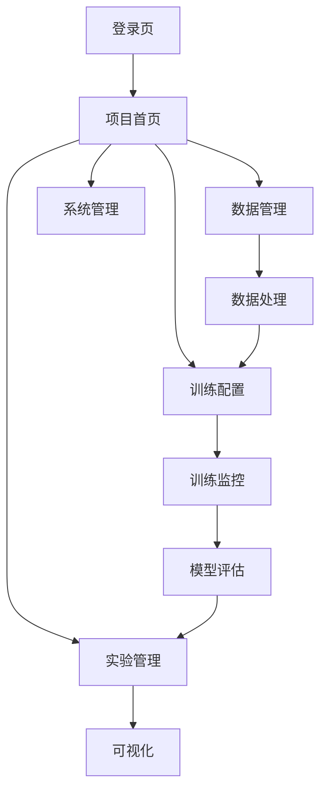

## ProteinX Infra 产品需求文档

## 1. 产品概述

ProteinX Infra 是一个分布式架构的生物数据AI训练平台，专为独立研究团队设计。系统支持灵活的物理部署，将管理、计算和交互分离，提供便捷的部署体验。

### 部署架构（三机模式）
- **个人机 (Client)**: 研究人员的笔记本/PC，仅需浏览器访问管理端网页，用于操作和监控。
- **管理机 (Master Node)**:
  - 托管 Web 前端和 API 服务。
  - **数据中心**: 存储原始元数据、项目配置、实验记录、训练日志和最终产物（模型权重/评估报告）。
  - **调度中心**: 管理计算节点连接，分发训练任务。
- **计算机 (Worker Node)**:
  - 配备高性能 GPU/CPU/大内存。
  - 运行轻量级 Agent，随时连接到管理机。
  - 负责执行具体的数据处理、模型训练和评估任务。
  - 任务执行时从管理机拉取数据，完成后回传结果，可随时替换或横向扩展。

## 2. 核心功能

### 2.1 用户与节点
- **安全认证**:
  - **用户登录**: 强制用户登录，使用 JWT (Access Token + Refresh Token) 进行会话管理。
  - **节点认证**: 计算节点接入 Master 必须提供预共享密钥 (PSK) 或 Token。
  - **组件安全**: 数据库、Redis、MinIO 等中间件均开启强密码认证。
- **节点管理**:
  - 管理端提供"计算节点池"页面。
  - 计算端通过 Token/IP 注册到管理端，状态实时可见（空闲/忙碌/离线）。

### 2.2 功能模块

1. **元数据管理 (Master)**:
   - 统一上传入口，文件存储在管理机。
   - 支持数据预览与校验。
2. **项目工作流**:
   - **子模型定义**: 配置数据处理、训练参数、评估策略。
   - **任务分发**:
     - 用户点击"开始训练"，系统打包配置和数据链接。
     - 调度器选择空闲计算节点下发任务。
   - **远程执行 (Worker)**:
     - Worker 接收任务 -> 拉取数据 -> 本地预处理 -> 训练/评估 -> 回传 Logs/Checkpoints -> 清理临时数据。
3. **实时监控**:
   - 个人机通过 WebSocket 实时查看计算机上的训练进度和资源占用（显存/利用率）。
4. **产物归档**:
   - 训练结束后，所有核心产物（权重、指标）自动回传至管理机持久化保存。

### 2.3 部署体验要求
- **管理机 Docker 化**: 管理机（Web/API/Redis/存储）使用 Docker 镜像与 Compose 部署，支持强口令与 .env 管理。
- **计算机 Conda 化**: 计算节点使用源码 + Conda 环境（environment.worker.yml），按需启用 GPU，加速迭代与调试。
- **灵活组网**: 计算节点只需知道管理机 IP 即可接入，支持动态增减。


| 页面 | 功能 |
| --- | --- |
| **数据中心** | 统一管理上传的元数据和原始文件。 |
| **项目列表** | 显示所有项目，支持新建。 |
| **项目详情** | 显示该项目下的所有子模型列表。 |
| **子模型画布/配置页** | 核心工作区：<br>1. **数据**: 勾选元数据 -> 配置预处理参数。<br>2. **模型**: 选择架构 -> 配置超参数。<br>3. **策略**: 勾选AMP/DDP，设置评估轮次。<br>4. **执行**: 启动训练/评估。<br>5. **结果**: 查看张量路径、权重路径、评估报表。 |


## 3. 核心流程

### 典型用户流程：

1. **项目创建**: 用户登录 → 创建新项目 → 设置项目基本信息和权限
2. **数据准备**: 上传生物数据 → 数据验证 → 选择预处理方法 → 执行数据处理
3. **模型训练**: 选择模型架构 → 配置训练参数 → 启动训练任务 → 监控训练过程
4. **模型评估**: 训练完成后 → 自动评估模型性能 → 生成评估报告 → 与其他模型对比
5. **实验管理**: 系统自动记录实验信息 → 用户查看实验历史 → 比较不同实验 → 选择最佳模型

### 页面导航流程图



## 4. 用户界面设计

### 4.1 设计风格

* **主色调**: 科技蓝 (#1890ff) 搭配白色背景，体现专业性

* **辅助色**: 成功绿 (#52c41a)、警告橙 (#faad14)、错误红 (#f5222d)

* **按钮样式**: 圆角矩形，主要操作用实心按钮，次要操作用边框按钮

* **字体**: 中文使用思源黑体，英文使用Roboto，正文字号14px，标题16-24px

* **布局风格**: 左侧导航栏 + 右侧内容区的卡片式布局

* **图标风格**: 使用简洁的线性图标，符合生物信息学主题

### 4.2 页面设计概览

| 页面名称 | 模块名称 | UI元素                           |
| ---- | ---- | ------------------------------ |
| 项目首页 | 项目列表 | 卡片式布局显示项目，包含项目名称、描述、创建时间、数据量统计 |
| 数据管理 | 数据上传 | 拖拽上传区域，支持多文件选择，显示上传进度条         |
| 训练监控 | 实时监控 | 动态折线图显示损失和准确率，使用不同颜色区分训练集和验证集  |
| 模型评估 | 性能指标 | 仪表盘样式显示关键指标，雷达图展示多维度性能对比       |
| 可视化  | 数据展示 | 交互式3D分子结构查看器，支持旋转、缩放、选择操作      |

### 4.3 响应式设计

* **桌面优先**: 主要面向桌面端用户，支持1920x1080及以上分辨率

* **移动端适配**: 支持平板设备（768px以上），手机端提供核心功能简化版本

* **触控优化**: 图表和可视化组件支持触控操作，适合演示场景

## 5. 技术特性

### 5.1 数据格式支持

* **序列数据**: FASTA、FASTQ、GenBank、EMBL格式

* **结构数据**: PDB、mmCIF、MOL2格式

* **注释数据**: GFF、BED、VCF格式

* **表格数据**: CSV、TSV、Excel格式

### 5.2 计算性能

* **并行处理**: 支持多GPU训练，自动分布式训练

* **内存优化**: 大数据集分块处理，支持数据流式加载

* **缓存机制**: 预处理结果缓存，避免重复计算

* **断点续训**: 训练中断后支持从最近检查点恢复

### 5.3 扩展性

* **插件机制**: 支持自定义数据处理模块和评估指标

* **API接口**: 提供RESTful API供外部系统集成

* **模型导入**: 支持导入自定义PyTorch模型架构

* **导出功能**: 训练好的模型可导出为标准格式

## 6. 项目目录结构

```
ProteinX-Infra/
├─ master/                      # 管理端（Web/UI + API）
│  ├─ src/                      # 管理端前端源码与页面
│  ├─ Dockerfile                # 管理端前端镜像构建文件（从 master 目录构建）
│  └─ README.md                 # 管理端说明与使用指南
├─ compute/                     # 计算端（Worker/Agent）
│  ├─ src/                      # 计算节点/训练代理源码
│  ├─ setup.py / requirements   # 依赖清单（Conda/venv）
│  └─ scripts/                  # 计算端启动与运维脚本
├─ docs/                        # 文档
│  ├─ product_requirements.md
│  └─ technical_architecture.md
├─ plan/                        # 版本计划与操作指南
│  └─ v1_0.md
├─ tmp/                         # 开发机临时工作目录（开发阶段作工作目录）
├─ test/                        # 教学/示例项目与测试资源
└─ .dockerignore                # 构建上下文忽略规则（排除 tmp/、test/ 等）
```

### 目录设计要点
- 管理端（master）以 Docker 发布 Web/UI；API 可按需容器化或原生运行以便与主机 DB/Redis 强口令集成。
- 持久化数据不纳入仓库与镜像，由管理机登录后在系统中输入一个工作目录（workdir），后续所有数据与产物均写入该目录。
- 开发阶段在本机使用 tmp 作为工作目录，部署阶段在管理机输入实际路径（如 /data/proteinx 或 D:\ProteinXWorkdir）。
- .dockerignore 排除 tmp/ 与 test/ 等非必要内容，保证镜像构建上下文最小化。
