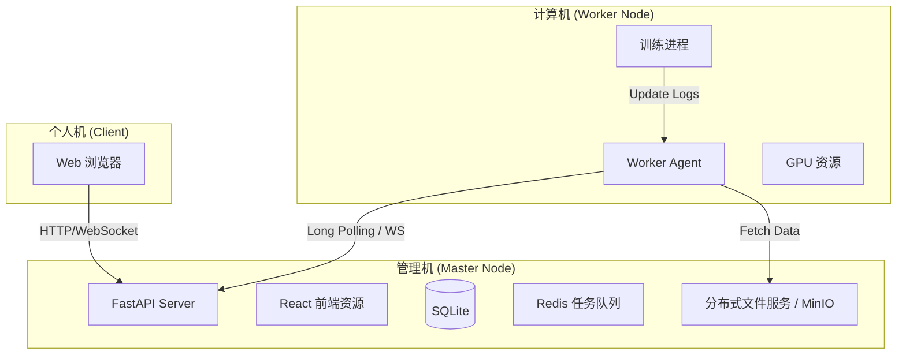

## 1. 分布式部署架构

系统采用 **Master-Worker** 架构，实现管理与计算的解耦。



### 1.1 组件职责

* **Master Node (管理端)**:

  * **前端 Docker**: 仅将前端 (React) 以 Docker 镜像发布。
  * **后端原生运行**: 后端 (FastAPI) 原生运行（venv/Conda），与主机 DB/Redis 强口令配置集成。

  * 负责存储：所有元数据、项目配置、任务状态、最终模型权重。

  * 负责调度：将任务推送到 Redis 队列，或通过 API 等待 Worker 领取。

* **Worker Node (计算端)**:

  * **源码 + Conda 环境**: 使用 `environment.worker.yml` 创建 Python 3.11 环境，安装训练所需依赖。

  * **Agent 逻辑**:

    1. 启动时配置 Master IP。
    2. 轮询/监听 Master 的任务队列。
    3. 收到任务 -> `wget/curl` 从 Master 下载数据 -> 启动子进程训练 -> 实时回传 Log -> 训练结束 `POST` 回传权重文件 -> 清理临时数据。

## 2. 关键技术流

### 2.1 数据流转

1. **上传**: 用户 -> Master (保存至 `<workdir>/raw`).
2. **分发**: Worker 领任务 -> 下载 `<workdir>/raw/xyz.fasta` 到本地临时目录.
3. **归档**: Worker 训练完 -> 上传 `outputs/model.pth` 到 Master -> Master 存入 `<workdir>/artifacts/<job_id>/`.

### 2.2 任务调度与容错

* 使用 **Celery** 或 **RQ (Redis Queue)** 作为核心调度机制。

* Redis 部署在 Master 上，Worker 远程连接 Redis。

* **心跳机制**: Worker 定期向 Master 发送心跳，Master 页面展示活跃节点。

* **灵活切换**: 若计算机更换，只需在新机器启动 Worker 容器并指向 Master IP，无需迁移数据。

## 3. API 设计更新

### 3.1 节点管理 API

* `GET /api/nodes`: 列出注册的 Worker 节点及其状态 (CPU/GPU info).

* `POST /api/nodes/heartbeat`: Worker 上报心跳.

### 3.2 任务 API

* `POST /api/jobs`: 创建训练任务 (状态: pending).

* `GET /api/jobs/{id}/logs`: 获取实时日志 (从 Redis/DB 读取).

* `POST /api/jobs/{id}/artifacts`: Worker 回传产物接口.

## 4. 部署方案

### 方案 A: 管理端 Master 部署（Web/UI Docker + API 原生/容器化）

**Master Web/UI (Docker)**
```
cd master
docker build -t proteinx/master-web:v1.0 .
docker run -d -p 3000:80 --name px-master-web proteinx/master-web:v1.0
```

**Master API (原生)**
```
cd master
python -m venv .venv
. .venv/bin/activate  # Windows 使用 .venv\Scripts\activate
pip install -r requirements.txt
uvicorn app.main:app --host 0.0.0.0 --port 8000
```

**工作目录 (workdir)**
```
# 管理机登录后在系统设置页面输入 workdir（如 /data/proteinx 或 D:\ProteinXWorkdir）
# 后端将把所有持久化数据写入该目录：<workdir>/raw, <workdir>/processed, <workdir>/artifacts, <workdir>/logs
```

### 方案 B: 计算端 Compute 部署（源码 + Conda）

**方式 1：Conda 环境文件**

1. 在计算机上安装 Anaconda/Miniconda
2. 在源码根目录执行：
```
conda env create -f environment.worker.yml
conda activate proteinx-worker
```
3. 配置环境变量：
```
MASTER_URL=http://<MASTER_IP>:8000
REDIS_URL=redis://:<REDIS_PASSWORD>@<MASTER_IP>:6379
```
4. 启动 Worker Agent（示例）：
```
python -m worker.agent --master $MASTER_URL --redis $REDIS_URL
```

**方式 2：手动安装（无 Conda 时）**
```
python -m venv .venv
source .venv/bin/activate
pip install -r requirements-worker.txt
```

## 7. 核心服务组件

### 7.1 训练引擎服务

* **功能**: 管理PyTorch训练任务的生命周期

* **技术**: PyTorch Lightning + DistributedDataParallel

* **特性**: 支持多GPU训练、自动混合精度、梯度累积

### 7.2 数据处理服务

* **功能**: 生物数据预处理和特征提取

* **技术**: Biopython + Dask + NumPy

* **特性**: 支持序列对齐、结构解析、批量处理

### 7.3 实验跟踪服务

* **功能**: 集成MLflow进行实验管理和模型注册

* **技术**: MLflow Tracking Server + MLflow Registry

* **特性**: 自动记录参数、指标、artifacts

### 7.4 资源调度服务

* **功能**: 管理GPU资源和训练任务调度

* **技术**: Celery + Redis + Docker

* **特性**: 任务队列管理、资源分配、故障恢复

## 8. 部署架构

### 8.1 部署形态
- **前端容器化**: 前端以单容器运行，端口映射 80:3000（或由反向代理统一到 80/443）。
- **后端原生化**: 后端以原生进程运行，连接主机上的 DB/Redis（强口令），读写指定 workdir。

### 8.2 环境配置

* **开发环境**: Docker Compose本地部署

* **测试环境**: Kubernetes集群部署

* **生产环境**: 云原生架构（支持AWS/GCP/Azure）

### 8.3 监控和日志

* **应用监控**: Prometheus + Grafana

* **日志收集**: ELK Stack (Elasticsearch + Logstash + Kibana)

* **性能监控**: 训练任务GPU利用率、内存使用率实时监控
